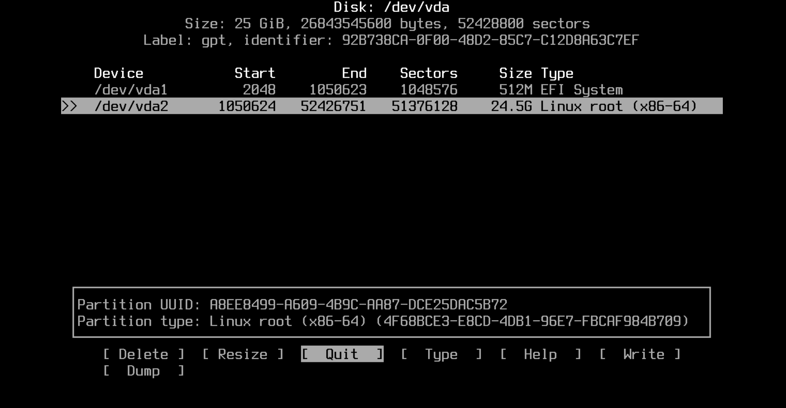

## 04. Verificar ruta de Instalación y creación de la tabla de particiones: 

Usa el comando `fdisk` para que te muestre los discos que tienes instalados en el sistema y sus rutas:

```bash
fdisk -l
```

Con el disco donde quieres instalar el sistema identificado, usa la herramienta cfdisk para entrar al disco. Como ejemplo entraré al disco *nvme0n1*:

```bash
cfdisk /dev/nvme0n1
```

Al entrar puede pedirte qué tipo de tabla de particiones quieres usar, como estamos usando el *estándar UEFI* selecciona `GPT`. Luego entrarás a un menú interactivo que te muestra todas las particiones que posee tu disco. Los controles de abajo están explicados a continuación:

- `[New]`:  Funciona para *crear una partición nueva a partir de espacio libre o otra partición*. Te pedirá escoger la cantidad de espacio que deseas asignarle a tu nueva partición (puedes escribir la cantidad en Megabytes o en Gigabytes). 
- `[Type]`: Le *asigna un identificador a la partición seleccionada*. Esto es fundamental para indicarle al sistema qué tiene que hacer con esa partición y evitar problemas de permisos a futuro. Es importante que la partición EFI este marcada como `EFI System` y la del sistema principal como `Linux root (x86-64)`. 
- `[Write]`: Sirve para *guardar los cambios hechos en la tabla de particiones*. Escribe **yes** para confirmar. Esto borrará los datos de la partición que hayas seleccionado en caso de escoger una que tuviese información dentro.
- `[Quit]`: Opción para **salir del programa de particionado**. Presionas acá luego de darle a write.  

### 04.1. Particiones necesarias para la instalación de Arch en BTRFS: 

- `EFI`: El formato tiene que ser **vfat (fat32)**. Si tienes windows instalado en el disco es probable que tengas la partición al principio de la tabla de particiones con aproximadamente **~200MB** (dicho espacio es un poco insuficiente si deseas instalar otros sistemas operativos linux que guarden su kernel dentro de esta partición, aunque para tener solo Arch y Windows está dentro del mínimo funcional). 
- `Linux root (x86-64)`: de formato **BTRFS**. Es la partición donde alojaremos la raíz del sistema operativo (y el kernel en caso de tener espacio insuficiente en la partición EFI). El espacio puede ser el de tu preferencia. **Recomiendo mayor a 80GB** para uso diario, si solo es de pruebas con 25GB-40GB es suficiente.

> [!NOTE]
> **Partición Linux Swap:**
> Existe otra partición de tipo `Linux Swap` que sirve para alojar todos los procesos de la memoria RAM en esa partición cuando la computadora está hibernando. Así, al despertar la computadora, esos procesos se transfieren de nuevo a la RAM para dar la sensación de que "nunca se cerraron" tras hibernar el equipo. 
> 
> Esto puede ser de utilidad, pero si siempre vas a estar apagando la computadora completamente tras cada sesión de uso, el swap se vuelve innecesario. Incluso es molesto para aquellas personas que poseen equipos con mucha RAM (esto porque **la swap tiene que ser exactamente del mismo tamaño que la RAM total del equipo** para asegurar que funcione correctamente bajo mucha carga de memoria). Además. Si necesitas swap obligatoriamente, no es necesario crear una partición separada, simplemente creas un archivo `Swapfile` dentro de la *Linux root* que cumple exactamente la misma función que la partición swap de un sistema.  **Esto es mejor porque mantiene simple el sistema de particiones**.

#### 6.1.1. Ejemplo de una tabla de particiones de una VM:

En este caso, la tabla de particiones fue creada dentro de una  *Máquina Virtual*. El nombre con el que se indentifica el disco virtual de la VM se asigna como `vda` la mayoría de los casos. El nombre cambia en dependencia del tipo de unidad de almacenamiento que estamos usando (NVMe, SSD SATA, HDD, USB Drive, etc)



---

<div align="center">

[← Anterior](arch-install-03-internet.md) · [Índice](../README.md) · [Siguiente →](arch-install-05-formateo.md)

</div>
