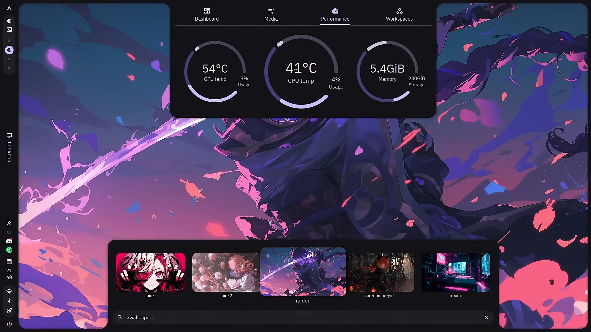
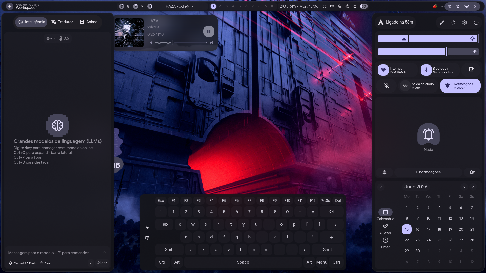
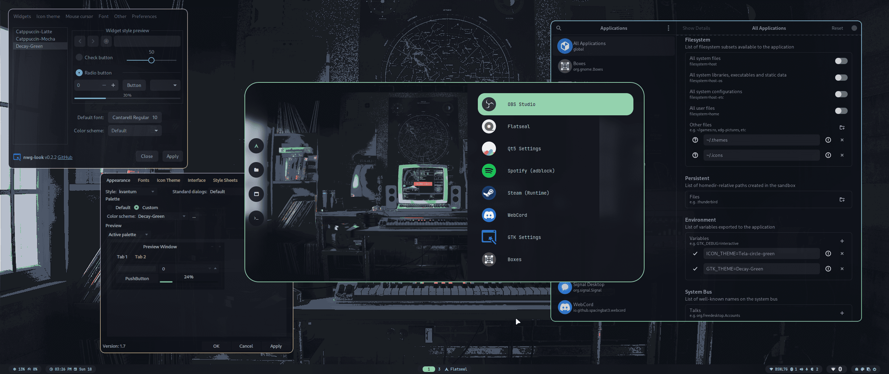

## 13. Instalación del Desktop Enviroment (Hyprland)

Hyprland es muy versátil y es en mi opinión el mejor para una distribución como Arch Linux por su ligereza y alta personalización, para instalarlo con todas sus dependencias hazlo con el siguiente comando: 

```bash
pacman -S hyprland xdg-desktop-portal-hyprland xorg-xwayland qt5-wayland qt6-wayland kitty
```

### 13.1. Configuración del entorno gráfico

Hyprland es de filosofía minimalista, lo que significa que solo te brinda lo básico indispensable para el funcionamiento del entorno, una terminal y worspaces. Es recomendable configurar todo el entorno paso por paso; desde la barra de estado, gestor de notificaciones, animaciones, atajos, etc. En el caso de que solo desees algo funcional, existen configuraciones hechas por la comunidad llamadas *dotfiles*. Como ejemplos están: 

#### 13.1.1. [Caelestia Shell](https://github.com/caelestia-dots/caelestia)




#### 13.1.2. [Illogical Impulse](https://ii.clsty.link/en/) 




#### 13.1.3. [HyDE](https://github.com/HyDE-Project)



---

### Créditos y referencias

Los siguientes proyectos son configuraciones comunitarias utilizadas como ejemplos de personalización para Hyprland. El contenido y los derechos de cada proyecto pertenecen a sus respectivos autores:

- [Caelestia Shell](https://github.com/caelestia-dots/caelestia) — `caelestia-dots/caelestia`.
- [Illogical Impulse](https://ii.clsty.link/en/) — proyecto de configuración comunitaria para Hyprland.
- [HyDE](https://github.com/HyDE-Project) — organización y proyecto de configuración comunitaria.

---

<div align="center">

[← Anterior](arch-install-12-refind.md) · [Índice](../README.md) · [Siguiente →](arch-install-14-reboot.md)

</div>
